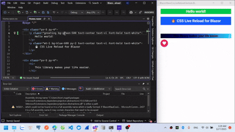

# CSS Live Reload for Blazor Maui 🔥

## Demo




## Why this Exists

Normally, changing a CSS file requires: 
- Rebuilding the app
- Restarting the WebView
- Losing all UI state

**BlazorMauiCssLiveReload** solves this with true CSS Hot Module Reloading. 
No rebuilds, no flicker, no WebView reloads.

## Features

### 🔥 1. Real CSS Hot Module Reloading

Blazor Hybrid normally requires a rebuild for CSS updates. 
CSS changes are pushed directly into the WebView:
- CSS updates apply instantly
- No WebView reload or UI flicker
- Supports plain CSS, `.razor.css`, and scoped styles

It feels closer to Flutter-style hot reload for styling.

### 🧵 2. Fully Compatible with .NET Hot Reload

Run your app using `dotnet watch` and both systems work together:
- .NET Hot Reload updates C# code
- `BlazorMauiCssLiveReload` updates CSS

You get a smooth, continuous development loop.

### 🧩 3. Tailwind-First Workflow

Tailwind JIT regenerates CSS on every file change.
This package is designed to fit directly into that workflow.

Perfect for modern frontend stacks.

## Installation

### 1. Install the NuGet package

```bash
dotnet add package BlazorMauiCssLiveReload
```

### 2. Add the JavaScript

Add the following script to your `wwwroot/index.html`:
```html
<script src="_content/BlazorMauiCssLiveReload/BlazorMauiCssLiveReload.js"></script>
```

### 3. Register the service

`MauiProgram.cs`:

```csharp
public static class MauiProgram
{
    public static MauiApp CreateMauiApp()
    {
        Log.Logger = new LoggerConfiguration()
            .MinimumLevel.Information()
            .WriteTo.File("Logs/log.txt", rollingInterval: RollingInterval.Day)
            .CreateLogger();

        var builder = MauiApp.CreateBuilder();
        builder
            .UseMauiApp<App>()
            .ConfigureFonts(fonts =>
            {
                fonts.AddFont("OpenSans-Regular.ttf", "OpenSansRegular");
            });

        builder.Services.AddMauiBlazorWebView();

#if DEBUG
		builder.Services.AddBlazorWebViewDeveloperTools();

#endif
        builder.Logging.AddDebug();
        builder.Logging.ClearProviders();
        builder.Logging.AddSerilog();

        builder.Services.AddMasaBlazor();

        builder.Services.AddCssLiveReload(options =>
        {
            options.ListenerPort = 5002;
            options.ListenerHost = "localhost";
            options.ServerUrl = "ws://localhost:5002/";
        });

        var app = builder.Build();

        // Fire-and-forget to initialize services without blocking app startup
        _ = InitializeBackgroundServicesAsync(app);

        return app;
    }

    private static async Task InitializeBackgroundServicesAsync(MauiApp app)
    {
        try
        {
            // Start WebSocket server first, then file watcher
            var server = app.Services.GetRequiredService<IEmbeddedCssServer>();
            await server.StartAsync();

            var watcher = app.Services.GetRequiredService<CssFileWatcher>();
            watcher.Start(FindProjectRoot(AppContext.BaseDirectory));
        }
        catch (Exception ex)
        {
            System.Diagnostics.Debug.WriteLine($"Error initializing background services: {ex}");
        }
    }

    private static string FindProjectRoot(string startPath)
    {
        var dir = new DirectoryInfo(startPath);

        while (dir != null && dir.Exists)
        {
            if (dir.GetFiles("*.csproj").Any())
                return dir.FullName;

            dir = dir.Parent;
        }

        throw new Exception("Cannot find project root (folder containing .csproj)");
    }
}
```

### 4. Enable Live Reload in your MainLayout.razor

```razor
@inherits LayoutComponentBase
@inject BlazorMauiCssLiveReload.CssLiveReloadService CssReload
@inject IJSRuntime JSRuntime

@Body

@code {
    protected override async Task OnAfterRenderAsync(bool firstRender)
    {
        if (firstRender)
        {
            await CssReload.ConnectAsync(JSRuntime);
        }
    }
}
```

## Usage

Run your app using Hot Reload:

**Windows:**

```bash
dotnet watch -f net10.0-windows10.0.19041.0
```

**Android:**

```bash
dotnet watch -f net10.0-android
```

**iOS:**

```bash
dotnet watch -f net10.0-ios
```

**MacCatalyst:**

```bash
dotnet watch -f net10.0-maccatalyst
```

## License

This project is licensed under the MIT License.

## Contributing

Contributions are welcome!  
Bug reports, feature requests, and discussions are open. 

## Support the Project

If this improves your DX, please consider starring the repo ❤️  
**Github:** https://github.com/chicuong2k3/BlazorMauiCssLiveReload

